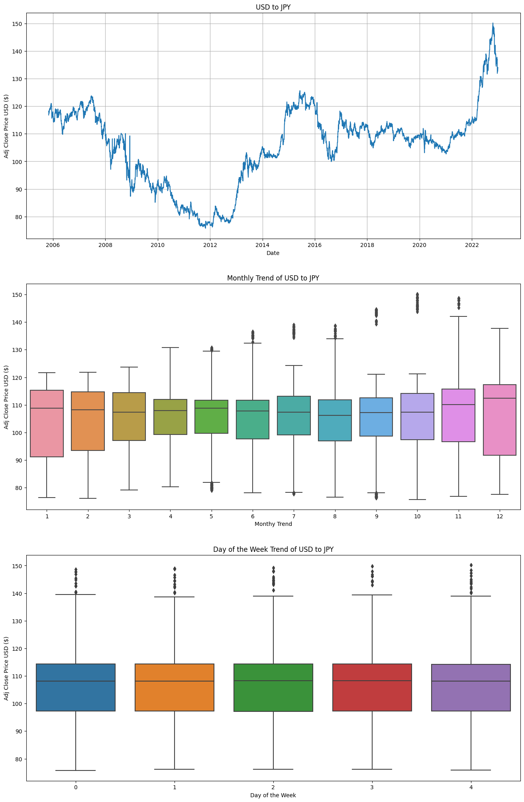
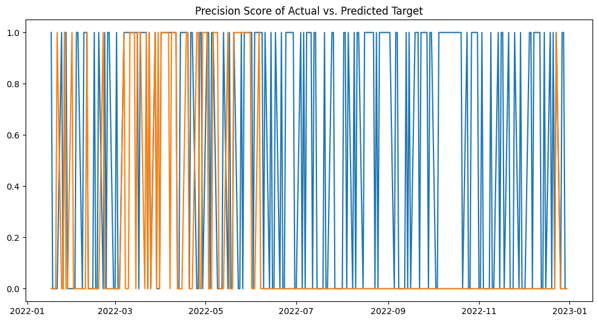

# YEN - USD Analysis

## Summary
This project involves an exploratory analysis of the Japanese Yen (YEN) to US Dollar (USD) exchange rate and predicting future values using a Random Forest Classifier. The data is sourced from the Yahoo Finance API, covering the period from January 1, 2002, to December 31, 2022.


## Preprocessing
- Checked for missing values
- Checked for data types
- Confirmed the DateTime series for Index (Date)

```plaintext
    DatetimeIndex: 5450 entries, 2002-01-01 to 2022-12-30
    Data columns (total 6 columns):
    #   Column     Non-Null Count  Dtype
    ---  ------     --------------  -----
    0   Open       5450 non-null   float64
    1   High       5450 non-null   float64
    2   Low        5450 non-null   float64
    3   Close      5450 non-null   float64
    4   Adj Close  5450 non-null   float64
    5   Volume     5450 non-null   int64
    dtypes: float64(5), int64(1)

    pandas.core.indexes.datetimes.DatetimeIndex
```
## Data Visualisation
- Added new columns for "Month of Year" and "Day of Week".
- Plotted the Adjusted Close Price to observe trends.
- Created box plots for "Month of Year" and "Day of Week".



## Target and Features
- Created a `Target` column representing the difference between the current day's price and the next day's price.
- Set the `Target` column to `1` or `0` to indicate whether the price will be higher or lower the next day.

- Selected the following feature columns: `Open`, `High`, `Low`, `Adj Close`, `Month`, `Day Of Week`.


## Train and Test Split Data
- Split the data for training and testing, using the last 250 rows for testing.

## Random Forest Classifer Model
- Trained the model using the Random Forest Classifer with the following parameters:
```python
  model = RandomForestClassifier(n_estimators=100, min_samples_split=10, random_state=1)
```

- Calculate the precision Score : 0.675

- Plotted Precision Score
  


## Back Testing
- Created a predictors function and a back testing function
- Performent backtesting to evaluate the prediction errors:
```plaintext
    0    1611
    1    1339
    Name: Predictions, dtype: int64
```
- Calculated the prediction score : 0.6056

- Percenagate of Correct Prediction
``` plaintext
    1    0.521017
    0    0.478983
    Name: Target, dtype: float64
```

## Adding New Features in Data
- Adding new features of 2, 5, 60,250,500 days as Ratio and Trend Column

## Grid Search
``` python
    Fitting 5 folds for each of 36 candidates, totalling 180 fits
    Best Score: 0.5180951325864668
    Best parameters: {'max_depth': 3, 'min_samples_split': 30, 'n_estimators': 200}

```

## Improving the Model
- Updated the Random Forest Classifier model with new parameters
```python
  model = RandomForestClassifier(n_estimators=200, min_samples_split=30, max_depth=3, random_state=1)
```

- Redefining predict model to increase the threshold of 60% for more precision

- Re-ran the backtesting
``` plaintext
    0.0    2386
    1.0      64

```
- Improved prediction score : **Prediction Score : 0.625**

## Limitations
- The USD/YEN exchange rate is influenced by other currencies; a CROSS-CURRENCY CORRELATION analysis is needed to determine impact on the USD/YEN valuation.
- Econimic Indicators such as interest rates, inflation rates, unemployment rates, GDP growth, trade balance, and monetary policies from both Japan and the US has been ignored for this exercise.
- The current data only considers daily adjusted close prices. A more granular breakdown, such as hourly or minute-by-minute prices, could improve precision scores.
- A Global News Sentiment Analysis leverageing Natural Language Processing (NLP) would result in more accurate result.
